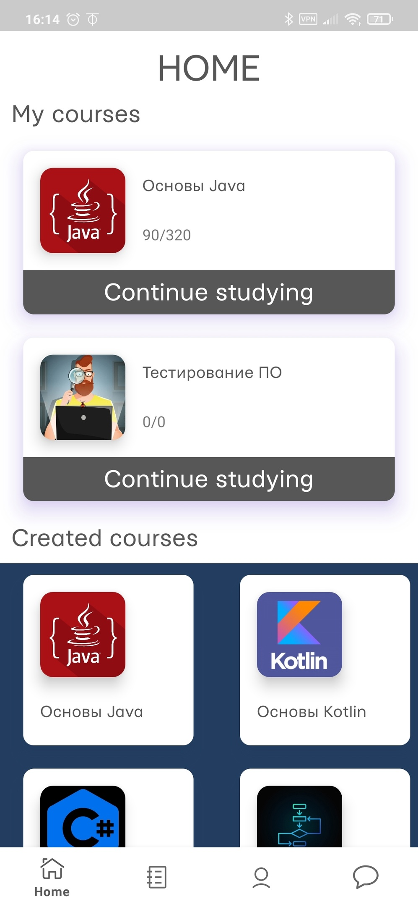
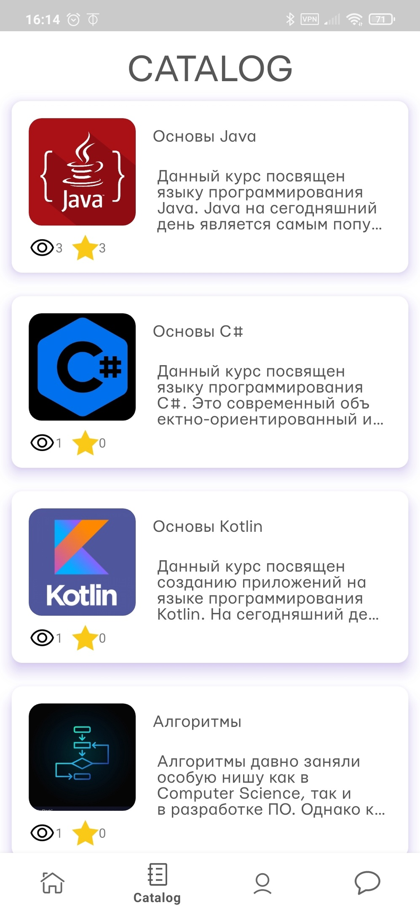
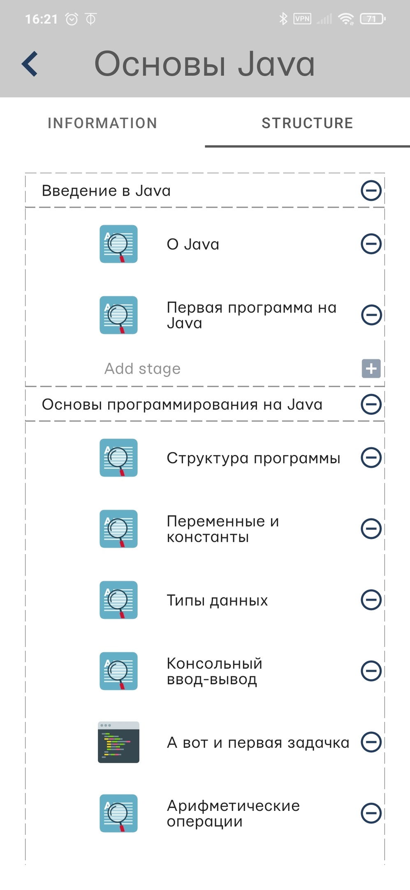
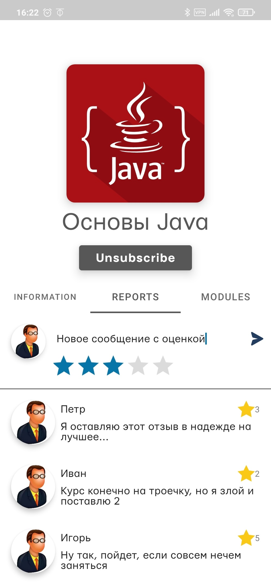
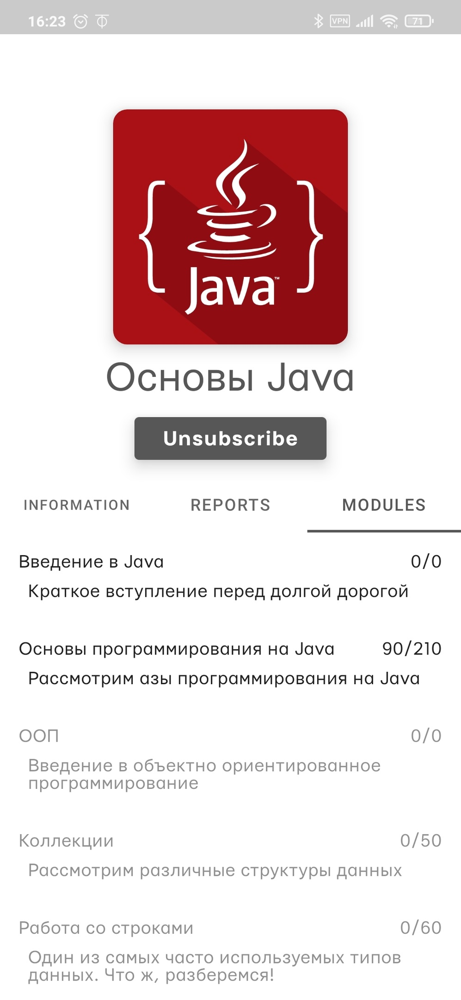
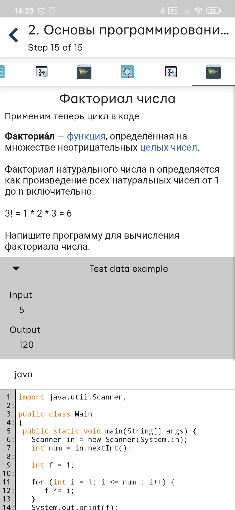
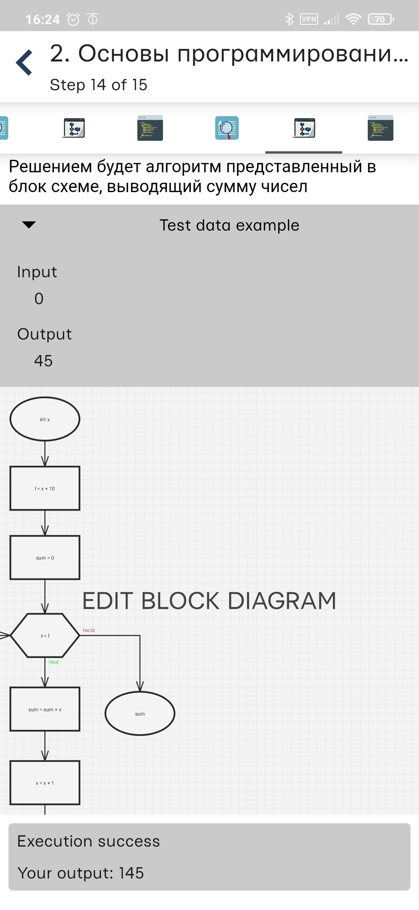
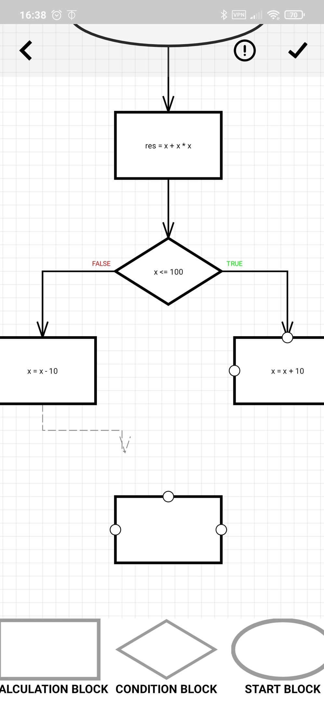

# Education platform

## Description

    An application that provides the opportunity to create and take courses related to programming.
    Interaction with the application takes place through two roles: student and teacher.

### Features:
- Registration/Authorization
- Creating a course
- Creating a lecture stage
- Creating a coding stage
- Creating a flowchart stage
- Passing the stages
- Leaving feedback and ratings on courses

## Tools

- MVVM
- Dagger 2
- Coroutines / Flow
- Room
- Retrofit 2
- Glide
- Navigation Component

## Screenshots

| Main screen                                            | Catalog                                                   |
|--------------------------------------------------------|----------------------------------------------------------|
|  |    |

| Course structure                                   | Reports                                             |
|--------------------------------------------------------|----------------------------------------------------------|
|  |    |

| Course structure for student                                   | Course's stage                                             |
|--------------------------------------------------------|----------------------------------------------------------|
|  |    |

| Flowchart stage                                   | Flowchart editor                                             |
|--------------------------------------------------------|----------------------------------------------------------|
|  |    |
